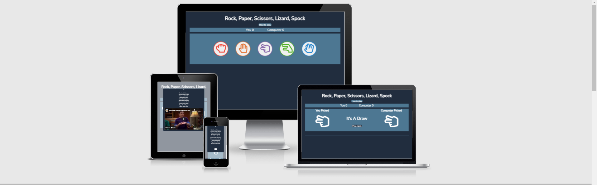

# Rock Paper Scissors Lizard Spock

[View the live project here.](https://will23jd.github.io/rock-paper-scissors-lizard-spock/)

Rock paper scissors lizard spock is a abaptation of the classic game rock paper scissors. The game was created by Sam Kass and brought to populatity by the show The Big Bag Theory. The game was made as an improvement of the classic game as people who knew each other where more likely to draw than win. By creating this game was created as a simple fun game to be played to pass the time while on the internet, such as wait for a call, document to download or if you've just go some spare time. 

## User Experience (UX)

* ### Design 

    * ### Imagery 

    * ### Color Scheme

    * ### Typography 

* ## Wireframes 

    * ### Landing Page 

    * ### Routes Page

    * ### Get In Touch Page

## Features

###  Features Left to Implement

## Testing

### Web browers

### Responsiveness

### Validator Testing

* HTML

* CSS

* Accessibility

### Fixed Bugs 

### Unfixed Bugs

## Technologies Used

### Languages Used

* [HTML5](https://en.wikipedia.org/wiki/HTML5)
* [CSS3](https://en.wikipedia.org/wiki/CSS)

### Framework, Libraries and Programs used

* [Balsamiq](https://balsamiq.com/wireframes/):
    * Used to create wireframes in the desgin process.
* [Google Fonts](https://fonts.google.com/):
    * Google fonts was used to import the Roboto and Rubix fonts into css which is used on all pages.
* [Font Awesome](https://fontawesome.com/):
    * Used for the social media links in the footer.

## Deployment

### GitHub Pages

The project was deployed to GitHub Pages using the following steps...

1. Log in to GitHub and locate the [GitHub Repository](https://github.com/)
2. At the top of the Repository (not top of page), locate the "Settings" Button on the menu.
3. On the left side of the Settings page locate the pages Section (second to last one).
4. Under "Source", click the dropdown called "None" and select "main".
5. Refresh the page until it says your is published at:.
6. Click the link and it will take you to your page.

### Forking the GitHub Repository

Forking the repository allows us to have a copy of the original repository to view and make changes on our GitHub account with affecting to original work. Forking a repository can be done with the following steps.

1. Log in to GitHub and locate the [GitHub Repository](https://github.com/)
2. At the top right of the repository above settings, find and click the fork button. 
3. You will now have a copy in your account.

## Credits

### Code 

### Media

### Acknowledgements

* My Mentor for feedback throughout the project.
* Friends and family for help with testing and feedback