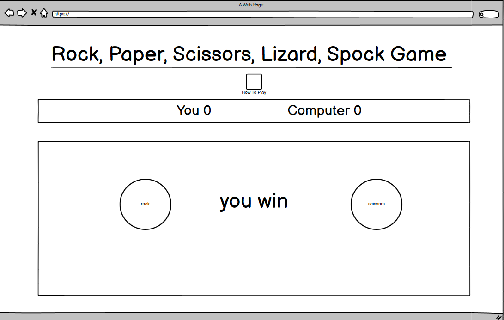

# Rock Paper Scissors Lizard Spock

[View the live project here.](https://will23jd.github.io/rock-paper-scissors-lizard-spock/)

Rock paper scissors lizard spock is a abaptation of the classic game rock paper scissors. The game was created by Sam Kass and brought to populatity by the show The Big Bag Theory. The game was made as an improvement of the classic game as people who knew each other where more likely to draw than win. By creating this game was created as a simple fun game to be played to pass the time while on the internet, such as wait for a call, document to download or if you've just go some spare time. 

## User Experience (UX)

* ## Use Goals
    * As a user I want to easily locate to rules on how to play.
    * As a user I want to experience to be easy to navigate without the use of back buttons in the brower.
    * As a user I want to be able to instantly the results of the game.
    * As a user I want to be able to keep count of the score of the game with a score bored.

* ## Design 

    * ### Imagery
        * I used images for the different choices (rock, paper, scissors, ect..) to give a clean a simple look.
        * I used bright colours for the images to make them stand out against the back ground and give the game an fun look.

    * ### Colour Scheme
        * For the colour scheme I used [dark blue](https://www.color-hex.com/color/212d3e)for the backgound of the game and white for the text.
        * I used a [lighter blue](https://www.color-hex.com/color/4d7792) for the background for the divs to make them stand out and break up the content.
        * For the game choices I used [red](https://www.color-hex.com/color/f44336), [orange](https://www.color-hex.com/color/e4773b), [purple](https://www.color-hex.com/color/8866aa), [green](https://www.color-hex.com/color/50b225) and [blue](https://www.color-hex.com/color/2587d1) to make them really sant out and pop.

    * ### Typography 
        * For the game I used the font [Nunito](https://fonts.google.com/specimen/Nunito?query=+++++++Nunito) with a fall back of sans-serif. I used this font because i was clear and easy to read as well as being bold to stand out.

* ## Wireframes 

    * ### Game page PC

    
    

    * ### Phones and tablets

    

## Features

### Title 
* At the top of of the page is a simple rock paper scissors lizard spock title in a bold white text. This is improtant because it lets the user know straight away what the game is.

### How to play button
* Under the title is a button which says 'How to play'
* This is an important feature to have at the top as it's right there if a user doesn't know how to play, so they dont have to go searching for the button or have to look the rules up them selves.
* The button scales up and swaps the text and background colours when hovered over to further imply that you can click on it.
* When the button is click it will bring up a popup window that shows the rules of the game and a video(Which shows the game being described in The Big Bang Theory)
* The user can then click on the X (which will turn red and scale up on hover) to exit back to the game or click anywhere else on the page.

### Score bored 
* The score bored is above the game area and haves two players 'You' and the 'Computer'.
* The score for each player incease's by 1 for a win and stays the same for a draw.

### Game choices
* The last element on the page is the game area in which the user can pick one of the 5 icons(Rock, Paper, Scissors, etc...)start the game.
* When the user hovers over which icon it will scale up and have a green border around it.

### Result
* When the user makes a choice the game area will change to a result area displaying the results of the round.
* With user pick on the left and the computer pick on the right and the result in the middle.
* In the bottom middle there is a play again button(That scales up and swaps colours of hover), which will bring back the game area.

###  Features Left to Implement

## Testing

### Web browers
    * When testing in different browers I wanted to make sure all feature and style look and functioned the same. This is important so that the user can have the same exprince on any different brower. I tested that the page opens and works in browsers: Chrome, Edge, Firefox, Safari, and Bing. To test the different browsers I used my iPhone to load the page on safari and my computer to test Chrome, Edge, Firefox, and bing

### Responsiveness
    * I test that this project is responsive, keeps a consistent style, function as intended and looks good on all screen sizes. To make sure my site worked on different devices I loaded the page on an iphone XR, 13" laptop, 15" laptop and my PC which is displaying to a 24" monitor. To test my site on my screen sizes I didn't have I used dev tools. Through my testing I found my points in which content overlapped, this allowed me to know what sections, divs and elements to include in my media queries.

### Functions
    * As the game logic for the game workes using javascript I want to make sure nothing changed causing the game to break when running on different browers.

### Validator Testing

* HTML

* CSS

* Accessibility

### Fixed Bugs 

### Unfixed Bugs

## Technologies Used

### Languages Used

* [HTML5](https://en.wikipedia.org/wiki/HTML5)
* [CSS3](https://en.wikipedia.org/wiki/CSS)

### Framework, Libraries and Programs used

* [Balsamiq](https://balsamiq.com/wireframes/):
    * Used to create wireframes in the desgin process.
* [Google Fonts](https://fonts.google.com/):
    * Google fonts was used to import the Roboto and Rubix fonts into css which is used on all pages.
* [Font Awesome](https://fontawesome.com/):
    * Used for the social media links in the footer.

## Deployment

### GitHub Pages

The project was deployed to GitHub Pages using the following steps...

1. Log in to GitHub and locate the [GitHub Repository](https://github.com/)
2. At the top of the Repository (not top of page), locate the "Settings" Button on the menu.
3. On the left side of the Settings page locate the pages Section (second to last one).
4. Under "Source", click the dropdown called "None" and select "main".
5. Refresh the page until it says your is published at:.
6. Click the link and it will take you to your page.

### Forking the GitHub Repository

Forking the repository allows us to have a copy of the original repository to view and make changes on our GitHub account with affecting to original work. Forking a repository can be done with the following steps.

1. Log in to GitHub and locate the [GitHub Repository](https://github.com/)
2. At the top right of the repository above settings, find and click the fork button. 
3. You will now have a copy in your account.

## Credits

### Code 

### Media

### Acknowledgements

* My Mentor for feedback throughout the project.
* Friends and family for help with testing and feedback